# 🎓 Smart Education Management System

> **Empowering Digital Education Through Artificial Intelligence**
>
> A next-generation education management platform designed to connect students, teachers, parents, and administrators through Artificial Intelligence, Learning Analytics, Smart Classroom Management, Digital Assessments, and Real-Time Academic Insights.

---

<p align="center">


</p>

---

# 📑 Table of Contents

- [Project Overview](#-project-overview)
- [Problem Statement](#-problem-statement)
- [Our Solution](#-our-solution)
- [Key Features](#-key-features)
- [System Workflow](#-system-workflow)
- [Technology Stack](#-technology-stack)
- [Project Architecture](#-project-architecture)
- [Project Screenshots](#-project-screenshots)
- [Business Impact](#-business-impact)
- [Future Roadmap](#-future-roadmap)
- [Project Team](#-project-team)
- [License](#-license)

---

# 🎓 Project Overview

Education is rapidly evolving through digital transformation. However, many educational institutions still rely on fragmented systems, manual processes, and disconnected communication channels that reduce operational efficiency and limit student engagement.

The **Smart Education Management System** is an AI-powered digital ecosystem that modernizes academic operations by integrating intelligent automation, real-time collaboration, learning analytics, and centralized education management into a single platform.

Designed for **Students, Teachers, Parents, and Educational Institutions**, the platform simplifies day-to-day academic activities while enhancing learning experiences through Artificial Intelligence and intelligent decision support.

The platform combines:

- Artificial Intelligence
- Learning Analytics
- Student Information Management
- Smart Classroom Operations
- Digital Assessments
- Attendance Automation
- Assignment Management
- Parent Communication
- Academic Performance Tracking
- AI-powered Educational Assistance

into one unified intelligent education ecosystem.

---

# 🚩 Problem Statement

Traditional educational institutions continue to face operational and academic challenges that hinder effective learning and administration.

### Institutions commonly struggle with:

- 📄 Manual Student Record Management
- ⏳ Time-Consuming Administrative Tasks
- 📚 Inefficient Assignment & Homework Tracking
- ❓ Delayed Student Query Resolution
- 📊 Limited Academic Performance Insights
- 👨‍👩‍👧 Weak Parent-Teacher Communication
- 📝 Manual Attendance Management
- 📈 Difficulty Monitoring Student Progress
- 📢 Inefficient Announcement Distribution
- 📂 Scattered Educational Resources

These challenges impact learning quality, reduce institutional productivity, and increase administrative workload while limiting meaningful collaboration between students, teachers, and parents.

---

# 💡 Our Solution

The Smart Education Management System delivers an integrated digital learning environment powered by Artificial Intelligence, automation, and real-time analytics.

Our platform empowers educational institutions to:

- Manage students through a centralized academic portal
- Automate attendance tracking and classroom operations
- Simplify assignment creation and submission
- Provide AI-assisted learning support
- Digitize examinations and result management
- Enable real-time communication among teachers, students, and parents
- Track academic performance through intelligent dashboards
- Generate AI-driven insights for personalized education
- Organize educational resources in one secure platform
- Improve institutional decision-making through learning analytics

By integrating these capabilities into a single intelligent ecosystem, educational institutions can improve teaching efficiency, student engagement, academic transparency, and overall learning outcomes.

---

# 🚀 Key Features

## 👨‍🎓 Student Portal

The Student Portal provides a personalized digital learning environment where students can access academic resources, monitor their progress, communicate with teachers, and receive AI-powered learning assistance.

### Core Features

- 📊 Personalized Dashboard
- 📅 Smart Timetable
- 📖 Digital Study Materials
- 📝 Assignment Management
- 📈 Attendance Tracking
- 📊 Academic Performance Reports
- 🎯 Exam & Result Management
- 🔔 Notifications & Announcements
- 🤖 AI Learning Assistant

---

## 👨‍🏫 Teacher Portal

The Teacher Portal simplifies classroom management by providing intelligent tools for teaching, assessment, student engagement, and academic administration.

### Core Features

- 📊 Teacher Dashboard
- 👥 Student Management
- 📝 Assignment Creation
- 📚 Study Material Upload
- 📊 Attendance Management
- 📈 Result Management
- 📢 Announcements
- 🎓 Subject & Section Management
- 🤖 AI Question Paper Generator
- 🧠 AI Answer Evaluation
- 💬 Student Query Resolution
- 👤 Teacher Profile Management

---

## 👨‍👩‍👧 Parent Portal

The Parent Portal strengthens communication between schools and families by providing real-time visibility into student progress, attendance, academic performance, and institutional updates.

### Core Features

- 👨‍👧 Multi-Student Monitoring
- 📅 Timetable Visibility
- 📊 Attendance Summary
- 📈 Academic Performance Tracking
- 📝 Assignment Monitoring
- 📚 Homework Tracking
- 🧾 Examination Updates
- 💬 Communication Panel
- 🤖 AI Parent-Friendly Insights

---

## 🤖 Artificial Intelligence Features

Artificial Intelligence is integrated throughout the platform to improve learning experiences, reduce administrative workload, and provide actionable academic insights.

### AI Capabilities

- 🤖 AI Learning Assistant
- 📝 AI Question Paper Generation
- 📖 AI Answer Evaluation
- 💬 AI Student Query Resolution
- 📈 Student Performance Analytics
- 🎯 Personalized Learning Recommendations
- 📊 Academic Trend Analysis
- 👨‍👩‍👧 AI Parent Feedback Simplification

---
# 🔄 System Workflow

```text
                 Student / Teacher / Parent
                           │
                           ▼
              Smart Education Management System
                           │
      ┌────────────────────┼────────────────────┐
      ▼                    ▼                    ▼
 Student Portal      Teacher Portal      Parent Portal
      │                    │                    │
      ├──────────────┬─────┴─────┬──────────────┤
      ▼              ▼           ▼              ▼
Attendance      Assignments   AI Learning   Performance
Management       & Exams       Assistant     Monitoring
      │              │           │              │
      └──────────────┼───────────┼──────────────┘
                     ▼
          Artificial Intelligence Engine
                     │
      ┌──────────────┼──────────────┐
      ▼              ▼              ▼
 Question Paper   Answer        Learning
 Generation      Evaluation     Analytics
                     │
                     ▼
           Academic Insights & Reports
                     │
                     ▼
         Better Learning Outcomes
```

---

# 🛠 Technology Stack

### Frontend
- React.js
- HTML5
- CSS3
- JavaScript (ES6)
- Bootstrap

### Backend
- Python
- Django
- Flask

### API Development
- RESTful APIs

### Database
- PostgreSQL
- MySQL
- SQLite

### AI & Machine Learning
- TensorFlow
- PyTorch
- Scikit-learn
- OpenCV

### Data Processing
- Pandas
- NumPy

### Authentication & Security
- JWT Authentication
- OAuth 2.0

### Version Control
- Git
- GitHub

### Deployment
- Docker
- Docker Compose

### Cloud Platforms
- AWS
- Microsoft Azure
- Google Cloud Platform

### Development Tools
- VS Code
- Postman

---

# 🏗 Project Architecture

```text
                         +-------------------------+
                         |  Smart Education System |
                         +-----------+-------------+
                                     |
          +--------------------------+--------------------------+
          |                          |                          |
          ▼                          ▼                          ▼
 +----------------+        +----------------+        +----------------+
 | Student Portal |        | Teacher Portal |        | Parent Portal  |
 +--------+-------+        +--------+-------+        +--------+-------+
          |                         |                         |
          +------------+------------+------------+------------+
                       |                         |
                       ▼                         ▼
              AI Learning Engine        Academic Analytics
                       |                         |
                       +------------+------------+
                                    |
                                    ▼
                         Centralized Database
                                    |
                                    ▼
                        Reports & Notifications
```

---

# 📷 Project Screenshots

## 👨‍🎓 Student Dashboard

<p align="center">
  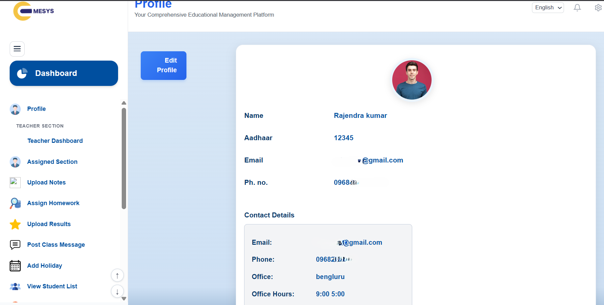
</p>

---

## 📝 Assignment Management

<p align="center">
  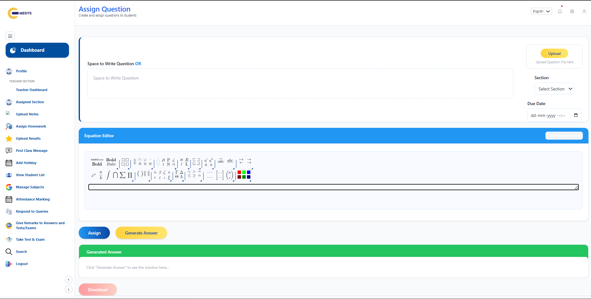
</p>

---

## 📈 Attendance Tracking

<p align="center">
  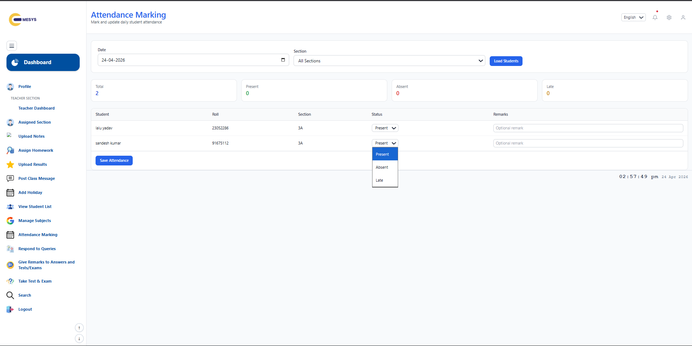
</p>

---

## 👨‍🏫 Teacher Dashboard

<p align="center">
  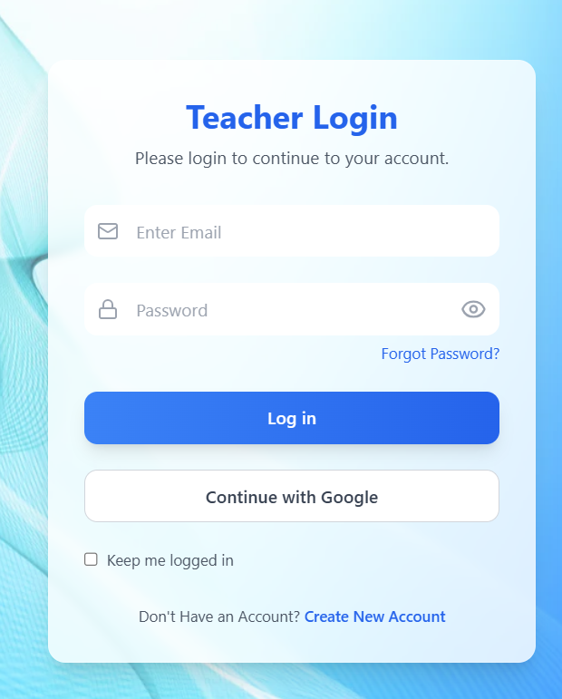
</p>

---

## 📝  Question Paper Generator

<p align="center">
  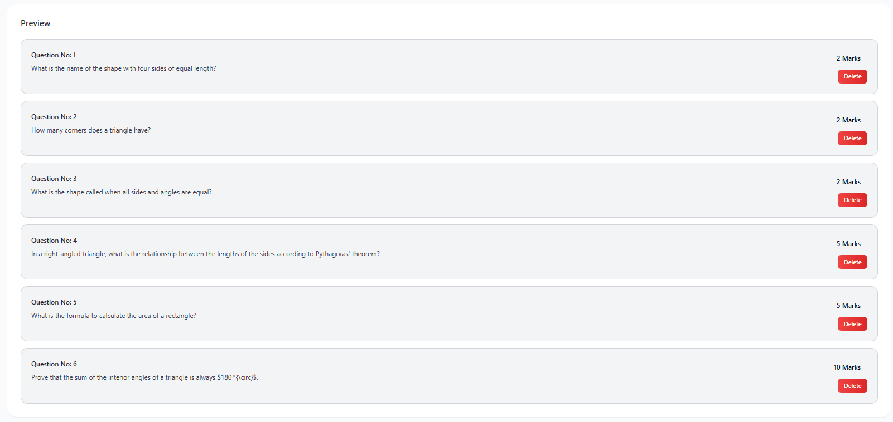
</p>

---

## 📖  Answer Evaluation

<p align="center">
  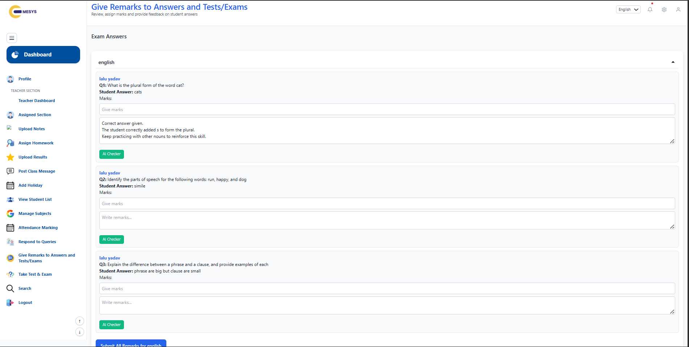
</p>

---

## 💬 Student Query Resolution

<p align="center">
  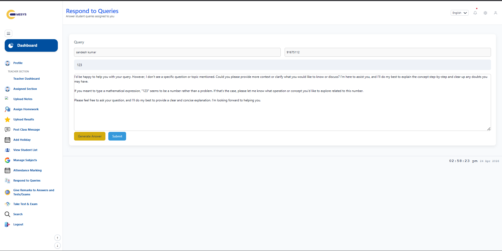
</p>


---

## 📝 Homework & Assignment System

<p align="center">
  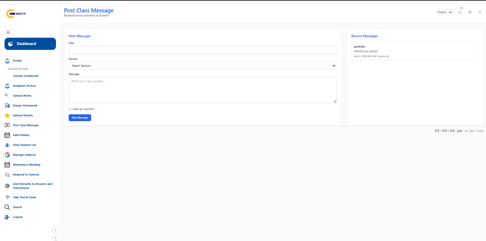
</p>

---

## 👥 Student Management

<p align="center">
  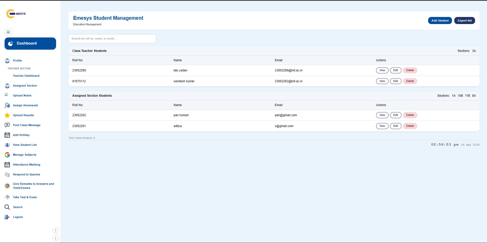
</p>

---

## 📢 Announcement Management

<p align="center">
  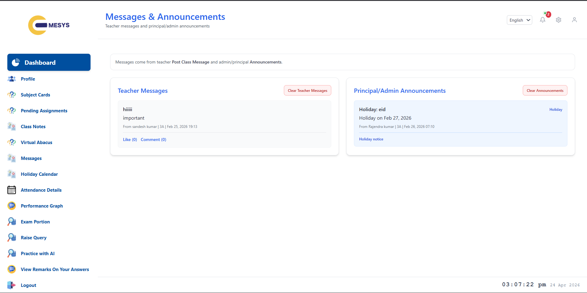
</p>

---

## 📊 Result Management

<p align="center">
  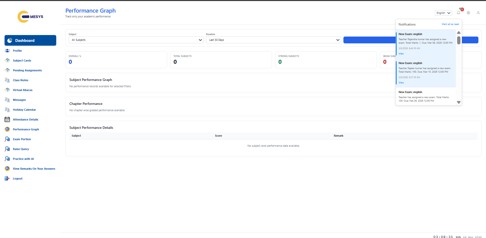
</p>

---

## 👨‍👩‍👧 Parent Dashboard

<p align="center">
  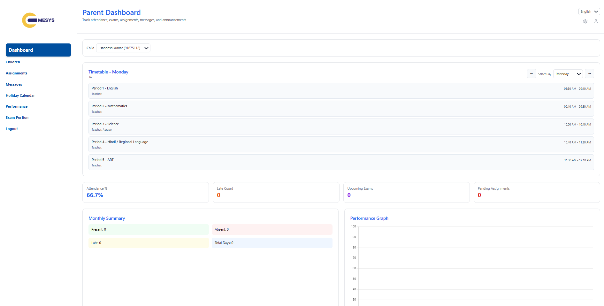
</p>

---

## 📈 Performance Tracking

<p align="center">
  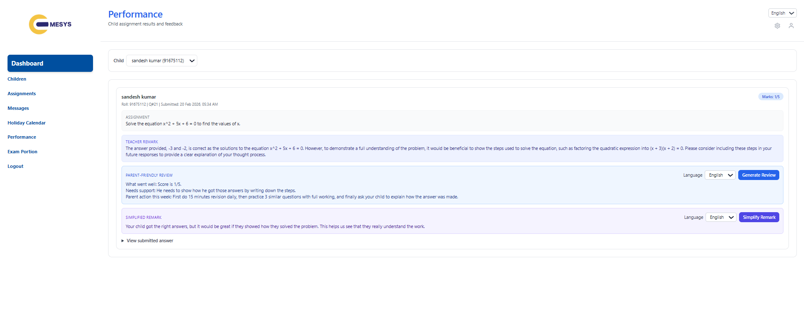
</p>

---

## 💬 Parent Communication Panel

<p align="center">
  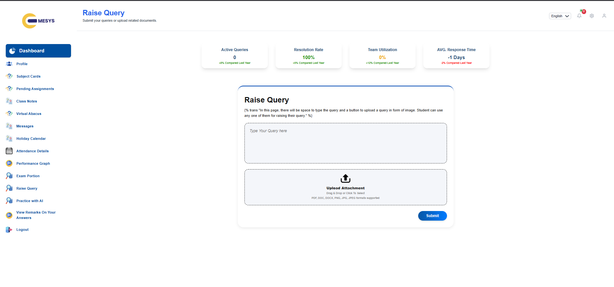
</p>

---

# 📊 Business Impact

📚 **60% Faster** Academic Administration

🤖 **75% Faster** Student Query Resolution

📝 **50% Reduction** in Manual Evaluation Effort

📈 **40% Better** Student Performance Monitoring

👨‍👩‍👧 **70% Higher** Parent Engagement

📊 **100% Digital** Student Record Management

🎯 **45% Improvement** in Learning Efficiency

📢 **80% Faster** Institutional Communication

---

# 🚀 Future Roadmap

- 🤖 AI-Based Personalized Learning Paths
- 🎤 Voice-Enabled Learning Assistant
- 📱 Android & iOS Mobile Applications
- 🧠 Predictive Student Performance Analytics
- 🎥 Live Virtual Classroom Integration
- 🌐 Multi-Language Learning Support
- 📚 AI Content Recommendation Engine
- 🏫 Multi-School Management Platform

---

# 👥 Project Team

<!-- This section is under development -->

---

# 📄 License

<!-- This section is under development -->

---

# 🌟 Vision

> *"Empowering educational institutions with Artificial Intelligence, intelligent learning analytics, and connected digital classrooms to build a smarter, more engaging, and future-ready education ecosystem."*

---

<p align="center">

**Made with ❤️ to transform education through Artificial Intelligence and Digital Learning.**

</p>
